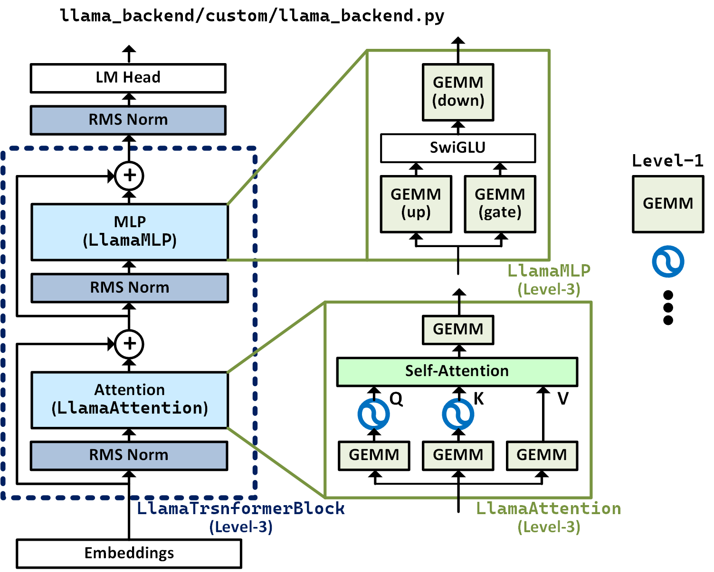

# Custom Llama Backend
### *A Modular, Research-Oriented Framework for LLM Compression, Quantization, and Custom Backend (including dataflow design and hardware acceleration)*

[](https://pytorch.org/)
[](https://www.python.org/)

Custom Llama Backend is a research framework built from the ground up in PyTorch. It is designed to facilitate deep analysis, development of quantization techniques for Large Language Models (LLMs), and custom backend design like dataflow design and hardware acceleration. It is primary focus on the **Llama** architecture (TinyLlama). 

Unlike standard inference engines, this project prioritizes **transparency**, **modularity**, and **numerical precision**, making it an ideal environment for researchers to test new algorithms like AWQ, mixed-precision policies, and custom hardware kernels.

---

## 🏗️ The Hybrid OOP Architecture

The core of this project is a unique **Hybrid Object-Oriented Architecture** that decouples mathematical operations from model structure. This allows researchers to swap out the entire computational backend without touching the transformer logic.



### 1. **Functional Foundation**
Stateless mathematical operations (RoPE, RMSNorm, Embedding) are implemented as pure functions for maximum performance and testability.

### 2. **Backend Strategy Pattern**
The `LlamaBackend` class acts as a strategy for all heavy computations (GEMM, Softmax). You can easily subclass it to implement:
- **Custom CUDA Kernels**
- **Quantized Matrix Multiplications**
- **FP8/INT4 Simulated Hardware Behaviors**

### 3. **Modular Structural Components**
`nn.Module` classes like `LlamaAttention` and `LlamaMLP` are fully decoupled. They accept a `LlamaBackend` instance via **Dependency Injection**, ensuring that model state (like KV Cache) remains separate from computation.

---

## 🌟 Key Features

- **🎯 Precision Autonomy**: Use `PrecisionPolicy` to control dtypes for every operation (Attn Matmul, FFN Matmul, Softmax, RoPE).
- **🔄 Triple-Backend Verification**:
  - `huggingface`: The "Ground Truth" reference.
  - `clone`: Functional parity check for bit-exact debugging.
  - `custom`: The high-flexibility modular backend supporting KV Cache.
- **🛡️ Advanced AWQ Toolkit**: A from-scratch implementation of **Activation-Aware Weight Quantization** with support for both fixed and mixed-precision strategies.
- **📊 Comprehensive Testbench**: Built-in evaluation scripts for HellaSwag, ARC, BoolQ, and more, comparing quantized accuracy against full-precision baselines.
- **🧩 Plug-and-Play Quantization**: Native support for **Block Floating-Point (BFP)** and custom quantization formats.

---

## 📂 Project Navigation

```bash
custom_llama/
├── llama_backend/          # 🧠 Core Model Implementation
│   ├── llama_custom.py     # Main CustomLlamaModel (nn.Module)
│   ├── custom/             # The OOP Backend Logic (Strategy Pattern)
│   ├── clone/              # Functional reference backends
│   └── precision_policy.py # Fine-grained compute dtype control
├── quantize_model_script/  # 📉 Quantization Algorithms (AWQ, BFP)
├── testbench/              # 🧪 Academic Task Evaluation Suite
├── debug/                  # 🔍 Parity and Precision Debugging Tools
├── docs/                   # 📖 Technical Deep Dives & Comparisons
└── model/                  # 📦 Pre-quantized Model Zoo
```

---

## 🚀 Getting Started

### 1. Environment Setup
We recommend using PyTorch 2.3.1 and CUDA 12.1 for the most stable experience.

```bash
# Recommended installation for CUDA 12.1
pip install --extra-index-url https://download.pytorch.org/whl/cu121 \
  torch==2.3.1 torchvision==0.18.1 torchaudio==2.3.1

# Install other requirements
pip install -r requirements.txt
```

### 2. Basic Inference
Load a model and run the custom backend with a specific precision policy.

```python
from llama_backend.llama_custom import CustomLlamaModel

# Load with mixed precision (BF16 compute)
model = CustomLlamaModel(
    model_name="TinyLlama/TinyLlama_v1.1",
    device="cuda",
    precision_policy="match_hf"
)

# Generate text
output = model.generate("The future of AI is", max_new_tokens=50)
print(model.tokenizer.decode(output[0]))
```

### 3. Running Evaluations
Benchmark your model on HellaSwag using the custom testbench.

```bash
python testbench/task_script_hellaswag.py \
    --model_path TinyLlama/TinyLlama_v1.1 \
    --backend custom
```

---

## 📈 Research and Results

Our framework has been used to benchmark dozens of quantization configurations. Key findings include:

| Precision Policy | Mean Abs Error (vs HF) | Accuracy (HellaSwag) |
|:---|:---:|:---:|
| `fp32` (Baseline) | < 1e-7 | 0.59 |
| `bf16` (Compute) | ~0.038 | 0.59 |
| `BFP` (4-bit, b=16) | ~0.15 | 0.54 |
| `AWQ` (4-bit, b=64) | **~0.11** | **0.57** |

For detailed comparisons, see [docs/backend_comparison.md](docs/backend_comparison.md).

---

## 🤝 Contributing & Extension

To implement a new quantization method or backend:
1. Subclass `LlamaBackend` in `llama_backend/custom/llama_backend.py`.
2. Implement your logic (e.g., a new `gemm` with quantization simulation).
3. Inject it into `CustomLlamaModel`.

---
*Created by [Frank Tsai](https://github.com/Frank-Tsai-23026407)*
